# 量测数据采集平台产品介绍

## 一句话价值

将分散在 CSV、Excel、设备图片中的量测结果，统一采集、配置、追溯和看板化，减少人工整理，提高产线量测数据可靠性。

## 当前痛点

- 设备数据分散在不同电脑、共享目录、Excel、CSV 和截图里。
- 人工复制粘贴 Excel 容易漏行、贴错生产编号或覆盖历史数据。
- 不同生产编号的量测项和指标配置重复，换料号时容易重新配置出错。
- 异常结果缺少来源文件、采集时间、工序和操作者记录，后续追溯困难。
- 采集失败后很难判断是路径、字段、权限、Sheet，还是设备文件仍在写入。
- 设备图片里的 Rx、Ry、Z 等数据如果只存在截图里，人工录入成本高。

## 平台解决方案

- **生产编号管理**：按生产编号集中维护量测配置。
- **量测项配置**：支持 CSV、Excel、Image OCR 数据源路径、Sheet、表头行、生产编号字段和工序字段。
- **指标配置**：每个量测项配置指标字段、单位、MS2/MS3 上下限。
- **模板复用**：从字段模板批量生成量测项和指标，套用时保留 snapshot，方便追溯当时模板内容。
- **测试读取**：正式入库前先预览字段、匹配行、工序和指标值。
- **手动/定时采集**：采集结果写入统一结果表，重复数据自动跳过。
- **Dashboard 看板**：查看 MS3/MS2/未达分布、趋势、失败任务、配置问题和 OCR 风险。
- **采集任务追踪**：每次测试读取、手动采集和定时采集都有 collect_job 记录。
- **结果作废追溯**：不物理删除采集结果，作废会记录人员、时间、原因和审计日志。
- **权限和审计**：viewer 只读，admin/engineer 才能维护配置或执行敏感操作。
- **数据库升级保护**：升级前自动备份，只新增字段/表，不清空核心数据。

## 标准使用流程

## 核心功能截图

### 登录与 Dashboard

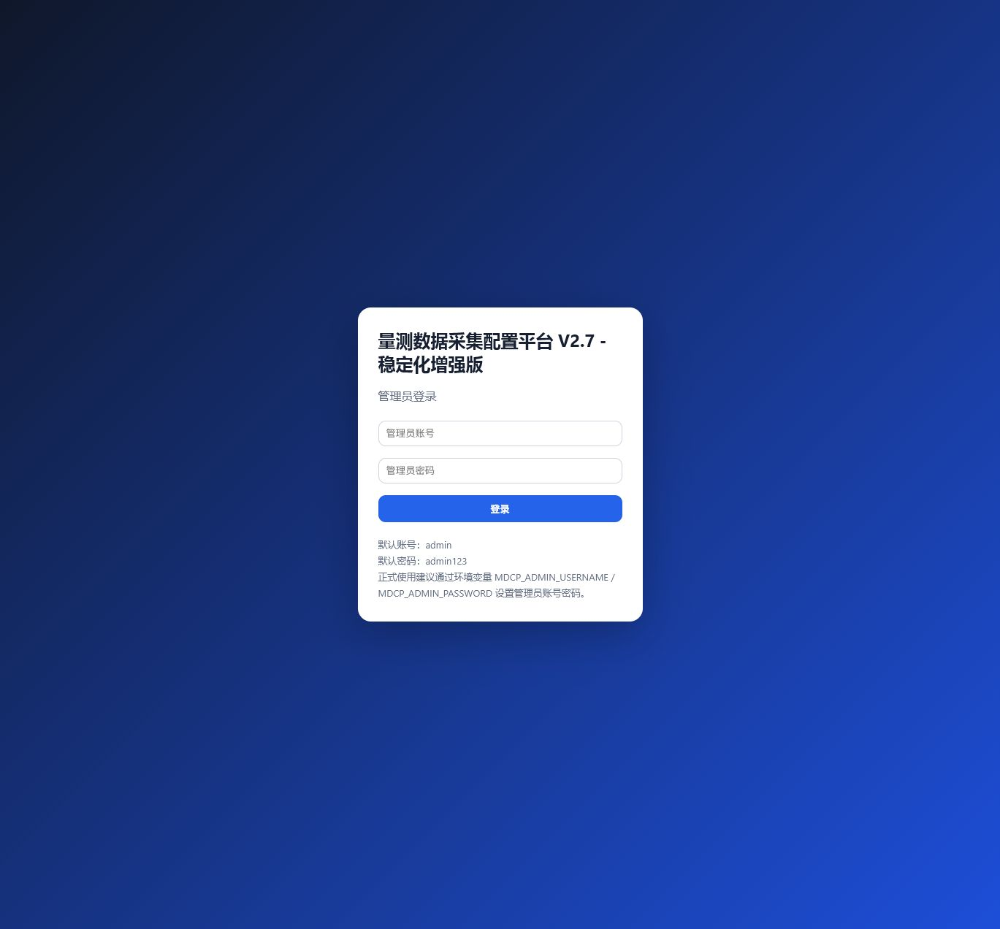

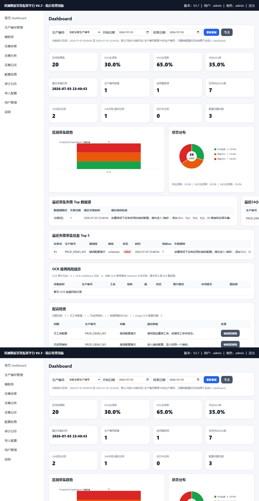

### 配置生产编号、量测项和指标

### 测试读取与采集

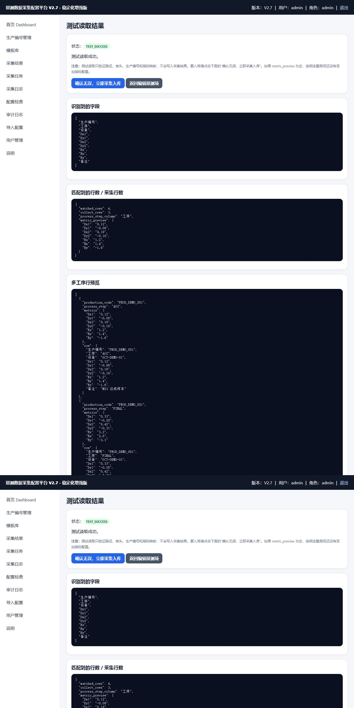

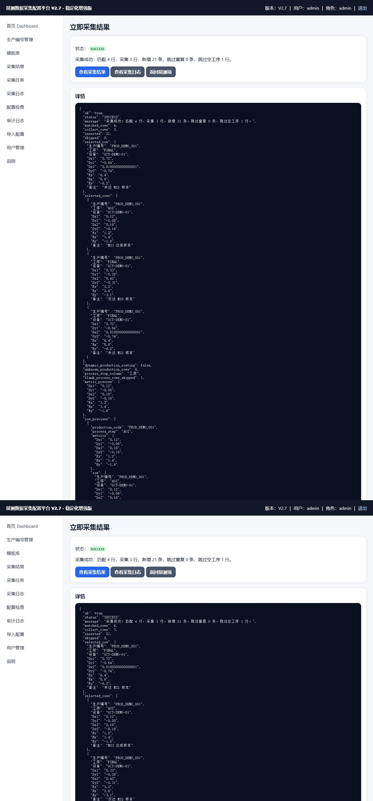

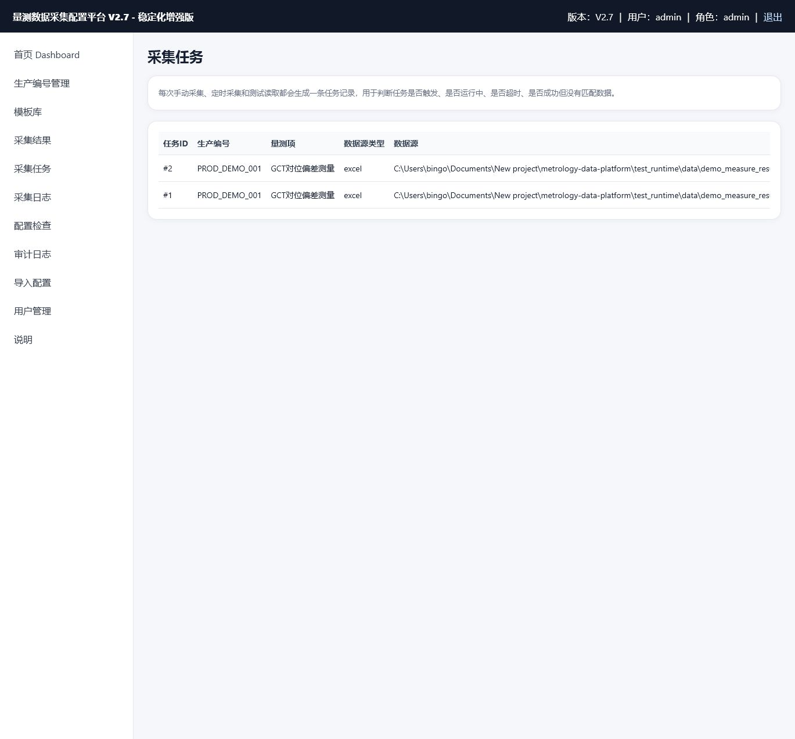

### 结果、作废、模板和权限

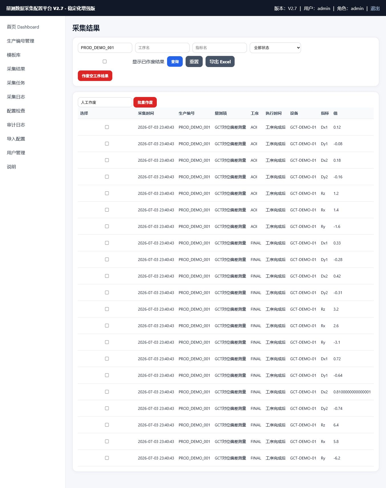

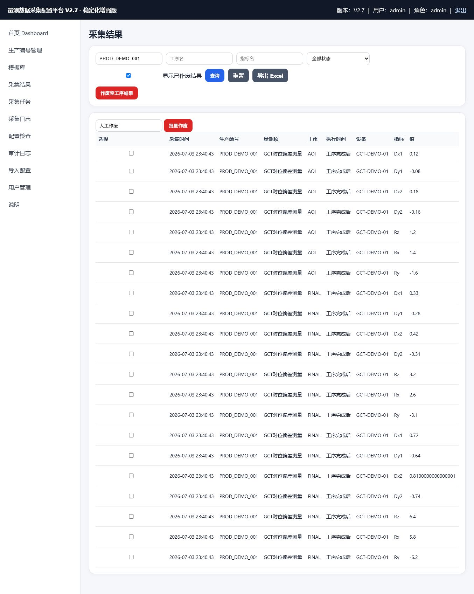

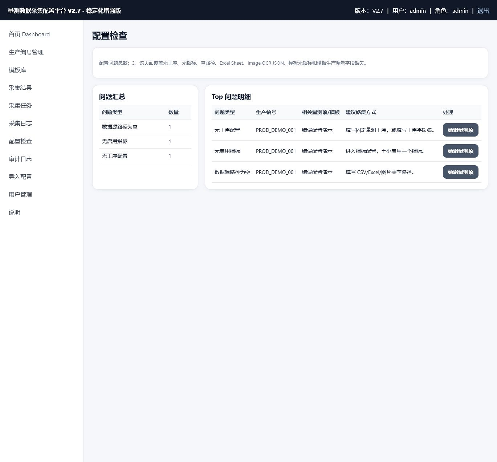

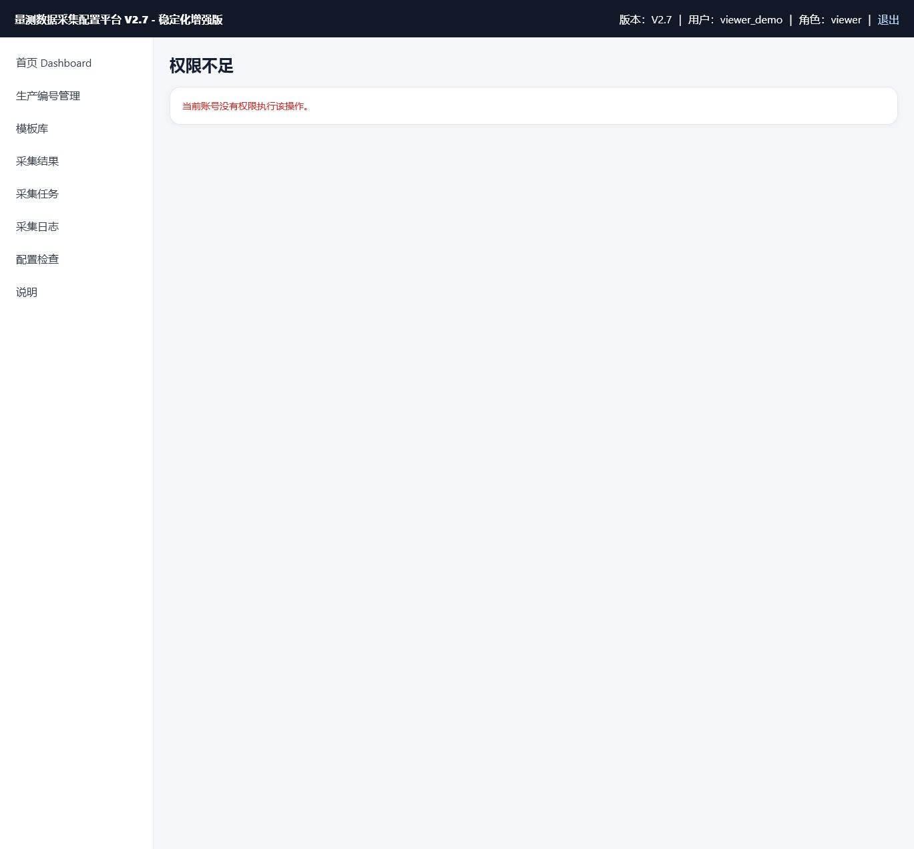

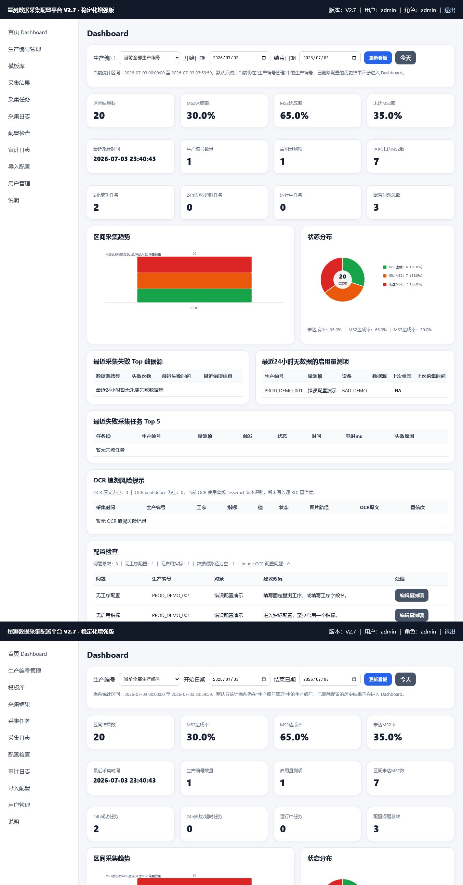

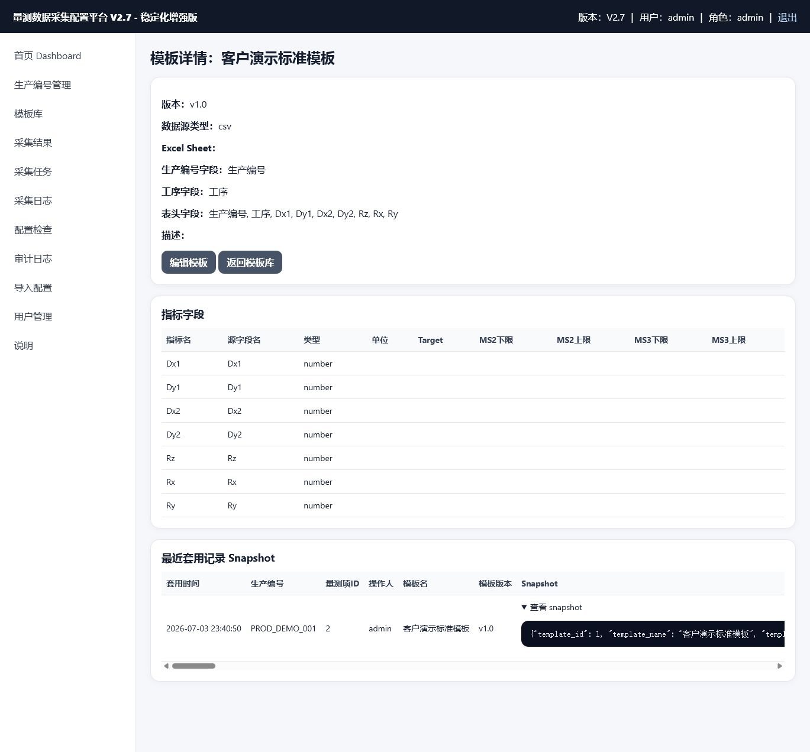

## 为什么客户愿意用

- 少做 Excel 复制粘贴，降低人为整理错误。
- 配置一次，多次复用；新生产编号可以从模板生成量测项。
- 哪个数据没采到、哪个路径失败、哪个配置不完整，可以在 Dashboard 和任务日志里查。
- 谁改了配置、谁作废了结果，都有审计记录。
- 结果能按生产编号、工序、指标、来源文件追溯。
- 支持现有设备导出的 CSV/Excel，也可扩展到设备截图 OCR，不强制改设备软件。
- 可先在本地或局域网小范围试运行，后续再升级为正式服务器平台。

## 当前适用范围

- 半导体、光学、模组、对位、轮廓、膜厚等工程量测数据收集。
- 设备可导出 CSV、Excel、xlsx/xlsm 文件的场景。
- 图片中存在可 OCR 的文字或数字，例如 Rx、Ry、Z，而不是需要从曲线形状计算的场景。
- 小规模产线试运行、工程验证、日报/周报数据自动归集。

## 当前边界与风险

- OCR 结果需要人工抽检或增加低置信度提示；不同设备截图版式变化时要重新配置 ROI 和正则。
- SQLite 适合试运行和小规模部署，大规模正式平台建议升级 PostgreSQL。
- 当前工具不是完整 MES/SPC 系统，暂不承担工单流转、制程管控和统计过程控制全量能力。
- 正式部署需要独立账号、强密码、局域网访问策略、定期数据库备份和运维机制。
- 产线电脑离线时，OCR 依赖、Tesseract 和 Python/EXE 包需要提前在可联网电脑打包好。

## 后续路线

- **P0：产品安全整理**：账号策略、默认密码治理、部署说明、备份恢复演练。
- **P1：稳定化增强**：采集任务追踪、角色权限、模板 snapshot、配置检查、数据库升级保护。
- **P2：正式平台化**：PostgreSQL、API 服务、MES/SPC 对接、正式任务队列和多用户部署。
